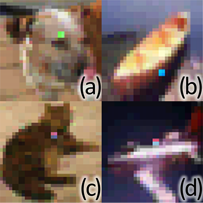
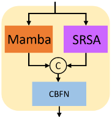
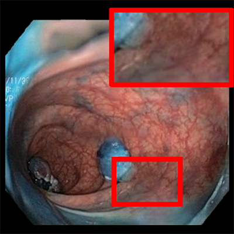
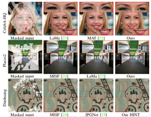
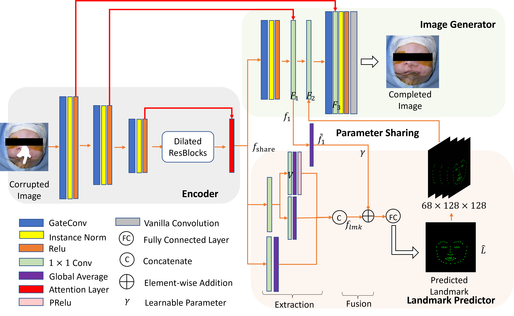
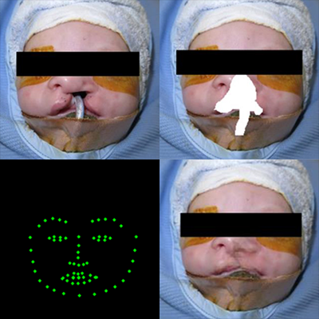

# Shuang (Chris) Chen

Currently in Durham (UK)

I am currently a final-year (2021-now) Ph.D. student in the Department of Computer Science, at <a href="https://www.durham.ac.uk/">Durham University</a> (UK), under the supervision of <a href="https://hubertshum.com/">Dr. Hubert P. H. Shum</a> and <a href="http://www.atapour.co.uk/">Dr. Amir Atapour Abarghouei</a>. Prior to that, I received my Master's degree from the <a href="https://www.surrey.ac.uk/">University of Surrey</a> (UK) and my Bachelor's degree from <a href="https://www.sdut.edu.cn/">Shandong University of Techonology</a> (China).

<!--My **research interests** lie primarily in computer vision and machine learning. I have done some works about image inpainting, vedio inpainting, denoising, deblurring.-->
<!--#### Technical Skills: Python, MATLAB, Android Studio-->

## Education
- Ph.D., Computer Science | Durham University							       		
- M.Sc., Computer Vision, Machine Learning and Robotics | The University of Surrey	        		
- B.S., Engineering | Shandong University of Technology

## Research Interests
- Computer Vision and Machine Learning
- Image Processing
- Image Inpainting, Denoising, Drblurring, Video Inpainting

Last Update: 20/07/2024

## News
- [<em><a style="color: #B23AF4">07/2024</a></em>] One paper is accepted by BMVC 2024.

- [<em><a style="color: #B23AF4">06/2024</a></em>] One paper is accepted by MICCAI 2024.
  
- [<em><a style="color: #B23AF4">06/2024</a></em>] One paper is accepted by IEEE Transactions on Instrumentation and Measurement (TIM), 2024.
  
- [<em><a style="color: #B23AF4">05/2024</a></em>] One of our work on Conversational Agents for Older Adults (CA4OA) has been accepted by Workshop on Engineering Interactive Systems Embedding AI Technologies (EISEAIT) 2024.

- [<em><a style="color: #B23AF4">03/2024</a></em>] I become a reviewer for IEEE Transactions on Multimedia (TMM).
  
- [<em><a style="color: #B23AF4">02/2024</a></em>] One paper is accepted by IEEE Transactions on Multimedia (TMM), 2024.
  
- [<em><a style="color: #B23AF4">02/2024</a></em>] I am involved in Conversational Agents for Older Adults (CA4OA) as a program developer.

## Map

## Teaching
- [<em><a style="color: #B23AF4">Demonstrator</a></em>]
	- Postgraduate Module: Text Mining and Language Analytics
	- Postgraduate Module: Programming for Data Science
	- 2nd Year Module: Network and System
	- 2nd Year Module: Machine Learning
	- 2nd Year Module: Data science (Probability, Image Processing and Computer Graphics)
   
## Experience
- <b>Research Assistant</b> at <a href="https://www.durham.ac.uk/">Durham University</a>

	02/2024 - 05/2024

	Project: <a href="https://aihs.webspace.durham.ac.uk/conversational-agents-for-older-adults-ca4oa/#:~:text=Trustworthy%20conversational%20agents%20(CAs)%20can,and%20cannot%20benefit%20from%20them.">Conversational Agents for Older Adults (CA4OA)</a>
 
	PI: <a href="https://www.durham.ac.uk/staff/lai-chong-law/">Effie Lai-Chong Law</a>

--------------------------------------------------
- <b>Student Helper</b> at <a href="https://www.durham.ac.uk//">Durham University</a>

	09/2022

   	Help to orignize The 21st annual ACM SIGGRAPH / Eurographics Symposium on Computer Animation (<a href="https://computeranimation.org/2022/index.html">SCA 2022</a>)

--------------------------------------------------
- I gave an invited presentation on Cleft Aesthetic Outcomes Research Group at Newcastle hosted by <a href="https://www.newcastle-hospitals.nhs.uk/consultants/mr-david-sainsbury/">David Sainsbury</a>

	12/2022

	Gave a presentation about our work "<a href="https://ieeexplore.ieee.org/abstract/document/9926917">A Feasibility Study on Image Inpainting for Non-cleft Lip Generation from Patients with Cleft Lip</a>" and "<a href="https://www.sciencedirect.com/science/article/pii/S2665963823000544">INCLG: Inpainting for non-cleft lip generation with a multi-task image processing network</a>"

--------------------------------------------------
- I gave an invited presentation at IEEE-EMBS International Conference on Biomedical and Health Informatics (<a href="https://bhi-bsn-2022.org/">BHI 2022</a>)

	10/2022

	Gave a presentation about our work "<a href="https://ieeexplore.ieee.org/abstract/document/9926917">A Feasibility Study on Image Inpainting for Non-cleft Lip Generation from Patients with Cleft Lip</a>"
   
## Selected Publications [<a href="https://scholar.google.com/citations?hl=en&user=tRLJ2X4AAAAJ">Google Scholar</a>]
<table id="tbPublications" width="100%" style="border-collapse:separate; border-spacing:0px 10px;">
	<body>

  
         <tr>
		<td><b>2024</b></td>
		<td>

        <tr>
		<td>

</td>
		<td>
			One-Index Vector Quantization Based Adversarial Attack on Image Classification 
			 
			<i>, <a href="https://ieeexplore.ieee.org/author/37086568367">Haiju Fan</a>, <a>Xiaona Qin</a>, <b>Shuang Chen</b>, <a href="https://hubertshum.com/">Hubert P. H. Shum</a>, <a href="https://www.htu.edu.cn/cs/_t83/2018/0524/c10537a246106/page.htm">Ming Li</a></i>
			 
            		Pattern Recognition Letters (<b>PRL</b>) 2024 <!--(<b>Spotlight</b>)-->
			 
			<!--[<a href='https://arxiv.org/abs/2212.02963'><b>paper</b></a>|] [<a href='https://github.com/FrancisXZhang/DAEVI'><b>code</b></a>]  -->

        <tr>
		<td>

</td>
		<td>
			MxT: Mamba x Transformer for Image Inpainting 
			 
			<i>, <b>Shuang Chen</b>, <a>Haozheng Zhang</a>,<a href="http://www.atapour.co.uk/">Amir Atapour Abarghouei</a>, <a href="https://hubertshum.com/">Hubert P. H. Shum</a></i>
			 
            		The 35th British Machine Vision Conference (<b>BMVC</b>) 2024 <!--(<b>Spotlight</b>)-->
			 
			<!--[<a href='https://arxiv.org/abs/2212.02963'><b>paper</b></a>|] [<a href='https://github.com/FrancisXZhang/DAEVI'><b>code</b></a>]  -->

   
	<tr>
		<td>

</td>
		<td>
			Depth-Aware Endoscopic Video Inpainting 
			 
			<i><a href="https://francisxzhang.github.io/">Francis Xiatian Zhang</a>, <b>Shuang Chen</b>, <a href="https://www.swansea.ac.uk/staff/x.xie/">Xianghua Xie</a>, <a href="https://hubertshum.com/">Hubert P. H. Shum</a></i>
			 
            		International Conference on Medical Image Computing and Computer Assisted Intervention (<b>MICCAI</b>) 2024 <!--(<b>Spotlight</b>)-->
			 
			<!--[<a href='https://arxiv.org/abs/2212.02963'><b>paper</b></a>|]-->[<a href='https://github.com/FrancisXZhang/DAEVI'><b>code</b></a>]  
		<!--</td>-->
	<!--</tr>-->

	 <tr>
		<td>

</td>
		<td>
			Inclusive AI-driven Music Chatbots for Older Adults
			 
			<i><a href="https://scholar.google.com/citations?user=CFXzL9cAAAAJ&hl=en">Farkhandah Aziz</a>, <a href="https://www.durham.ac.uk/staff/lai-chong-law/">Effie L. C. Law</a>, <a href="https://www.luisli.org/">Li Li</a>, <b>Shuang Chen</b></i>
			 
            		Engineering Interactive Systems Embedding AI Technologies (<b>EISEAIT</b>) 2024 <!--(<b>Spotlight</b>)-->
			 
			[<a href='https://www.easychair.org/publications/preprint_open/V5MJ'><b>paper</b></a>|<a href='https://github.com/l1997i/ca4oa-music-chatbot'><b>code</b></a>]

        <tr>
		<td>

</td>
		<td>
			HINT: High-quality INpainting Transformer with Mask-Aware Encoding and Enhanced Attention
			 
   			<i><b>Shuang Chen</b>,<a href="http://www.atapour.co.uk/">Amir Atapour Abarghouei</a>, <a href="https://hubertshum.com/">Hubert P. H. Shum</a></i>
			 
            		IEEE Transactions on Multimedia (<b>TMM</b>) 2024 <!--(<b>Spotlight</b>)-->
			 
			[<a href='https://ieeexplore.ieee.org/document/10458430'><b>paper</b></a>|<a href='https://github.com/ChrisChen1023/HINT'><b>code</b></a>|<a href='https://www.youtube.com/watch?v=Qkcg7nz1_rI'><b>video</b></a>]    
		<!--</td>-->
	<!--</tr>-->

 
         <tr>
		<td>

</td>
		<td>
			Geometric Features Enhanced Human-Object Interaction Detection 
			 
			<i><a href="https://scholar.google.com.hk/citations?user=d9P2VxwAAAAJ&hl=en/">Manli Zhu</a>, <a href="http://www.edho.net/">Edmond S. L. Ho</a>,<b>Shuang Chen</b>,<a href="http://lyang.uk/">Longzhi Yang</a>, <a href="https://hubertshum.com/">Hubert P. H. Shum</a></i>
			 
            		IEEE Transactions on Instrumentation and Measurement (<b>TIM</b>) 2024 <!--(<b>Spotlight</b>)-->
			 
			[<a href='https://ieeexplore.ieee.org/stamp/stamp.jsp?arnumber=10597665'><b>paper</b></a>|<a href='https://github.com/zhumanli/GeoHOI'><b>code</b></a>]

         <tr>
		<td><b>2023</b></td>
		<td>

  
         <tr>
		<td>

</td>
		<td>
			INCLG: Inpainting for non-cleft lip generation with a multi-task image processing network 
			 
			<i><b>Shuang Chen</b>,<a href="http://www.atapour.co.uk/">Amir Atapour Abarghouei</a>,<a href="http://www.edho.net/">Edmond S. L. Ho</a>,<a href="https://hubertshum.com/">Hubert P. H. Shum</a></i>
			 
            		Software Impacts, (<b>SIMPAC</b>) 2023 <!--(<b>Spotlight</b>)-->
			 
			[<a href='https://www.sciencedirect.com/science/article/pii/S2665963823000544'><b>paper</b></a>|<a href='https://github.com/ChrisChen1023/INCLG'><b>code</b></a> | <a href='https://codeocean.com/capsule/4388343/tree/v1'><b>CodeOcean</b></a>]
				
         <tr>
		<td><b>2022</b></td>
		<td>
         <tr>
		<td>

</td>
		<td>
			A Feasibility Study on Image Inpainting for Non-Cleft Lip Generation from Patients with Cleft Lip
			 
			<i><b>Shuang Chen</b>,<a href="http://www.atapour.co.uk/">Amir Atapour Abarghouei</a>,<a>Jane Kerby</a>, <a href="http://www.edho.net/">Edmond S. L. Ho</a>,<a href="https://www.newcastle-hospitals.nhs.uk/consultants/mr-david-sainsbury/">David C. G. Sainsbury</a>, <a href="https://www.researchgate.net/profile/Sophie-Butterworth-2">Sophie Butterworth</a>, <a href="https://hubertshum.com/">Hubert P. H. Shum</a></i>
			 
            		 IEEE-EMBS International Conference on Biomedical and Health Informatics (<b>BHI</b>) 2022 <!--(<b>Spotlight</b>)-->
			 
			[<a href='https://ieeexplore.ieee.org/abstract/document/9926917'><b>paper</b></a>|<a href='https://github.com/ChrisChen1023/NCLG-MT'><b>code</b></a>]     
   
		<!--</td>-->
	<!--</tr>-->
<!--</tbody>-->
<!--</table>-->

<!--
## Work Experience
**Data Scientist @ Toyota Financial Services (_June 2022 - Present_)**
- Uncovered and corrected missing step in production data pipeline which impacted over 70% of active accounts
- Redeveloped loan originations model which resulted in 50% improvement in model performance and saving 1 million dollars in potential losses

**Data Science Consultant @ Shawhin Talebi Ventures LLC (_December 2020 - Present_)**
- Conducted data collection, processing, and analysis for novel study evaluating the impact of over 300 biometrics variables on human performance in hyper-realistic, live-fire training scenarios
- Applied unsupervised deep learning approaches to longitudinal ICU data to discover novel sepsis sub-phenotypes

## Projects
### Data-Driven EEG Band Discovery with Decision Trees
[Publication](https://www.mdpi.com/1424-8220/22/8/3048)

Developed objective strategy for discovering optimal EEG bands based on signal power spectra using **Python**. This data-driven approach led to better characterization of the underlying power spectrum by identifying bands that outperformed the more commonly used band boundaries by a factor of two. The proposed method provides a fully automated and flexible approach to capturing key signal components and possibly discovering new indices of brain activity.

### Decoding Physical and Cognitive Impacts of Particulate Matter Concentrations at Ultra-Fine Scales
[Publication](https://www.mdpi.com/1424-8220/22/11/4240)

Used **Matlab** to train over 100 machine learning models which estimated particulate matter concentrations based on a suite of over 300 biometric variables. We found biometric variables can be used to accurately estimate particulate matter concentrations at ultra-fine spatial scales with high fidelity (r2 = 0.91) and that smaller particles are better estimated than larger ones. Inferring environmental conditions solely from biometric measurements allows us to disentangle key interactions between the environment and the body.

## Talks & Lectures
- Causality: The new science of an old question - GSP Seminar, Fall 2021
- Guest Lecture: Dimensionality Reduction - Big Data and Machine Learning for Scientific Discovery (PHYS 5336), Spring 2021
- Guest Lecture: Fourier and Wavelet Transforms - Scientific Computing (PHYS 5315), Fall 2020
- A Brief Introduction to Optimization - GSP Seminar, Fall 2019
- Weeks of Welcome Poster Competition - UTD, Fall 2019
- A Brief Introduction to Networks - GSP Seminar, Spring 2019

- [Data Science YouTube](https://www.youtube.com/channel/UCa9gErQ9AE5jT2DZLjXBIdA)

## Publications
1. Talebi S., Lary D.J., Wijeratne L. OH., and Lary, T. Modeling Autonomic Pupillary Responses from External Stimuli Using Machine Learning (2019). DOI: 10.26717/BJSTR.2019.20.003446
2. Wijeratne, L.O.; Kiv, D.R.; Aker, A.R.; Talebi, S.; Lary, D.J. Using Machine Learning for the Calibration of Airborne Particulate Sensors. Sensors 2020, 20, 99.
3. Lary, D.J.; Schaefer, D.; Waczak, J.; Aker, A.; Barbosa, A.; Wijeratne, L.O.H.; Talebi, S.; Fernando, B.; Sadler, J.; Lary, T.; Lary, M.D. Autonomous Learning of New Environments with a Robotic Team Employing Hyper-Spectral Remote Sensing, Comprehensive In-Situ Sensing and Machine Learning. Sensors 2021, 21, 2240. https://doi.org/10.3390/s21062240
4. Zhang, Y.; Wijeratne, L.O.H.; Talebi, S.; Lary, D.J. Machine Learning for Light Sensor Calibration. Sensors 2021, 21, 6259. https://doi.org/10.3390/s21186259
5. Talebi, S.; Waczak, J.; Fernando, B.; Sridhar, A.; Lary, D.J. Data-Driven EEG Band Discovery with Decision Trees. Preprints 2022, 2022030145 (doi: 10.20944/preprints202203.0145.v1).
6. Fernando, B.A.; Sridhar, A.; Talebi, S.; Waczak, J.; Lary, D.J. Unsupervised Blink Detection Using Eye Aspect Ratio Values. Preprints 2022, 2022030200 (doi: 10.20944/preprints202203.0200.v1).
7. Talebi, S. et al. Decoding Physical and Cognitive Impacts of PM Concentrations at Ultra-fine Scales, 29 March 2022, PREPRINT (Version 1) available at Research Square [https://doi.org/10.21203/rs.3.rs-1499191/v1]
8. Lary, D.J. et al. (2022). Machine Learning, Big Data, and Spatial Tools: A Combination to Reveal Complex Facts That Impact Environmental Health. In: Faruque, F.S. (eds) Geospatial Technology for Human Well-Being and Health. Springer, Cham. https://doi.org/10.1007/978-3-030-71377-5_12
9. Wijerante, L.O.H. et al. (2022). Advancement in Airborne Particulate Estimation Using Machine Learning. In: Faruque, F.S. (eds) Geospatial Technology for Human Well-Being and Health. Springer, Cham. https://doi.org/10.1007/978-3-030-71377-5_13

- [Data Science Blog](https://medium.com/@shawhin)

-->

<!--
**ChrisChen1023/chrischen1023** is a ✨ _special_ ✨ repository because its `README.md` (this file) appears on your GitHub profile.

Here are some ideas to get you started:

- 🔭 I’m currently working on ...
- 🌱 I’m currently learning ...
- 👯 I’m looking to collaborate on ...
- 🤔 I’m looking for help with ...
- 💬 Ask me about ...
- 📫 How to reach me: ...
- 😄 Pronouns: ...
- ⚡ Fun fact: ...
-->
